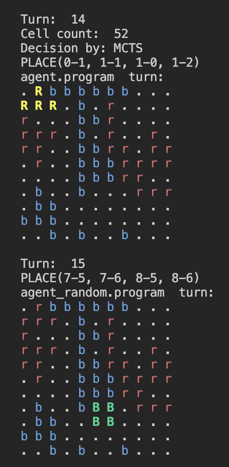

# Tetress Game Playing Agent

## Project Overview

This project involves the development of a game-playing agent for Tetress, employing two main algorithms: Monte Carlo Tree Search (MCTS) and Minimax with Alpha-Beta Pruning. The primary goal is to create an intelligent agent capable of making strategic decisions to outperform random opponents.

## MCTS Agent Approach

### Description

The MCTS Agent uses the Monte Carlo Tree Search (MCTS) algorithm to select actions throughout the game. MCTS efficiently explores the vast game tree by balancing exploration and exploitation, making it a suitable choice for Tetress.

### Implementation

- **Node Selection**: Utilizes the Upper Confidence bound applied to Trees (UCT) formula to select the child node with the highest UCT value.
- **Expansion**: Creates new child nodes for each possible move, but only keeps the ‘best’ 10 child nodes based on the highest UCT scores estimated by the heuristic evaluation function (HEF).
- **Simulation**: Conducts a random playout from the new node to the end of the game to estimate the value of each possible move.
- **Backpropagation**: Updates the statistics of the nodes from the new node to the root, using the UCB1 formula combined with the HEF value of the new node.

### Heuristic Evaluation

The heuristic evaluation function assesses the quality of each possible move based on:

- **Cell Count Ratio**: Ratio of the player's cell count to the opponent's cell count, prioritizing line clearing.
- **Holes Penalty**: Counts the number of holes on the board, encouraging nodes with even numbers of holes and penalizing those with odd numbers.

### Ending Strategy

An Ending class is employed when the game board has more than 85 filled cells, choosing actions to minimize the opponent's possible moves and increase the agent's chances of winning.

## Minimax Agent Approach

### Motivation

The Minimax algorithm with Alpha-Beta pruning was chosen based on its ability to play optimally under the assumption that the opponent is also playing optimally. It is hypothesized to outperform a random opponent in this deterministic game.

### Implementation

- **Node Structure**: Represents a node in the search tree, recording the board state, the move leading to that state, and the player's color.
- **MinimaxAgent Class**: The main class for the Minimax implementation, responsible for initializing the agent, selecting the best move, implementing the Minimax algorithm with Alpha-Beta pruning, and evaluating the board state using the heuristic evaluation function.

## Performance Evaluation

### Experimental Setup & Metrics

A tournament-style experiment was conducted, where each agent played 100 games against every other agent. The performance metrics included:

- **Win Rate**: The percentage of games won by each agent.
- **Board Control**: The average cell percentage at the game end for each agent.
- **Game Length**: The average number of turns taken by each agent to win a game.

### Results Discussion

The results showed that both the MCTS Agent and the Minimax Agent outperformed the Random Agent in terms of win rate and board control. The MCTS Agent's ability to adapt to changing game conditions contributed to its slightly higher performance.

## Supporting Work

### Count Holes Function

Developed to count the number of blocks with more than four continuous empty cells using disjoint set data structures, improving the performance of the evaluation function.

### Simulation Script

A custom simulation script was created to simulate games between two agents without relying on the referee module, allowing more accurate runtime examination and improvement identification.

### Profiling and Optimization

The cProfile library was used to profile the code, identify performance bottlenecks, and refine algorithms and data structures, leading to significant improvements in runtime efficiency.

### Hybrid Agent Testing

Tested a hybrid agent using Minimax in the first half and MCTS in the second half of the game, but it did not perform well compared to the MCTS and Minimax agents.

## Conclusion

The project successfully developed a Tetress game-playing agent using MCTS and Minimax algorithms, demonstrating the effectiveness of these approaches in strategic decision-making and outperforming random opponents.

#### Reference

This project is part of COMP30024 Artificial Intelligence Semester 1 2024 course at the University of Melbourne.